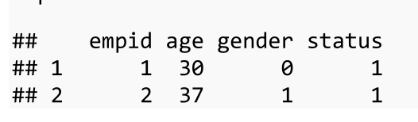
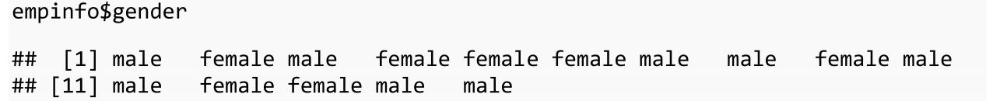
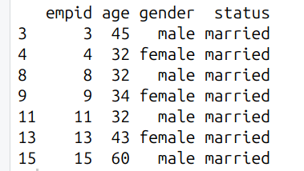
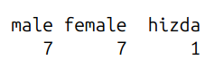
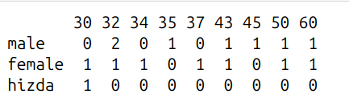
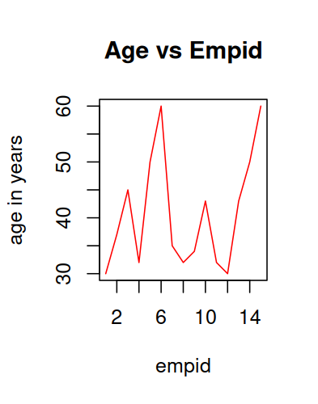

## Experiment 2
Plotting/visualising of Tables

### Assigning Values
```bash
X = 10;
X <- 10;
10 -> X;
```

### Vector
```bash
a = c(1, 3, 5, 7);
```

### TypeCasting
```bash
X = as.character(5.2)
```

### Creating a DataFrame
```bash
empid=c(1,2,3,4,5,6,7,8,9,10,11,12,13,14,15);

age.....

gender=c(0,1,0,1,1,1,0,0,1,0,0,1,1,0,0); # 0 and 1 are Male and Female

status=c(1,1,2,2,1,1,1,2,2,1,2,1,2,1,2); # Single(1) or Married(2)

empinfo = data.frame(empid, age, gender, status); # Create a Table like Structure
```


### Labeling character to numeric
```bash
empinfo$gender = factor(empinfo$gender, labels = c("male", "female", "hizda"));
                                                      0        1        2      # In Increasing Order
OR
empinfo$status = factor(empinfo$status, labels = c("Single", "Married"))
```


### Extracting Just Some Subsets of Data
```bash
# Extracting Data
female = subset(empinfo, empinfo$gender=="female");
OR
married = subset(empinfo, empinfo$status=="married");
```


### Getting the Summary
```bash
summary(empinfo);
OR 
summary(female);
```

### Table
table() is used for counting frequencies, not for displaying data frames
```bash
table = table(empinfo) # This is wrong coz its for frequency of a particular coloumn
```
This is Correct
one-way
```bash
table = table(empinfo$gender)
```


two-way
```bash
table1 = table(empinfo$gender, empinfo$age);
```


### Plotting

#### Scatter Plot
if x not specified it takes just 1-15
```bash
          x              y            
plot(empinfo$empid, empinfo$age, type = "l", main = "Age vs Empid", xlab = "empid", ylab="age in years", col = "red");
```


#### Pie: Uses Table(Coz Plot Frequencies only)

```bash
table = table(empinfo$gender)
pie(table)
```

### Bar Plot
Mostly uses Two way table freq
```bash
barplot(table3, beside = T, xlim=c(1,15), ylim=c(0,5), col = c("blue","red"))
```


## Experiment 3

### Variance and CO-variance
Assume data is a dataframe
```bash
v1 = var(data$speed);
v2 = var(data$model);

# For CO-variance
covariance = cov(data$speed,data$model); # Covariance tells you how two variables change together
# i.e. If +ve Directly Proportional, If close to 0 -> No clear relationship
```

### Correlation Coefficient
```bash
# Pearson Formulae
coeff = covariance/[sd(data$speed)*sd(data$model)];
OR
# Normal Method
coeff = cor(data$speed, data$model);
```

### Correlation Test
```bash
cor.test(data$speed, data$model, method = "pearson");
OR
cor.test(data$speed, data$model, method = "spearman");
```

### Regression
```bash
                     y          x
regression1 = lm(data$speed~data$hp);
# Before Plotting the Line First Plot the Two Variables
         x        y
plot(data$hp, data$speed); # Make sure x and y are correct, otherwise you cant see the line
abline(regression1);
# For Summary
summary(regression1);
```


## Experiment 4
Multiple Regression, Always use "scatterplot3d"
```bash
datset = mtcars;
# We are gonna calc how hp depends upon cyl and mpg
Y = mtcars$hp;
X1 = mtcars$cyl;
X2 = mtcars$mpg;
regression = lm(Y~ X1 + X2);

# For Equation
summary(regression); # It Will give you the Equation of Regression

# For Plotting
library(scatterplot3d);
plot = scatterplot3d(Y,X1,X2);

# If you want the Regression Plane to be visible
plot$plane3d(regression);
```


## Experiment 5
Binomial Distribution
Given,
n-> number of trials OR i.e. how many independent things which can give results
p -> Probability of Sucess

### (i) Probabilty of Getting Exactly 2 Heads
```bash
dbinom(2,n,p);
```
### (ii) Probabilty of Getting Atleast 2 Heads
```bash
sum(dbinom(2:4, n, p));
```
### (iii) Probability of Getting Atmost 2 Heads
```bash
sum(dbinom(0:2, n, p));
```
### (iv) Expectation of x
```bash
x=0:n;
px = dbinom(x,n,p);
Ex = weighted.mean(x,px); # Expectation
```
### For Variance
```bash
VarX = weighted.mean(x*x,px) - weighted.mean(x*x,px)^2;
```
### Plotting
```bash
plot(x,px,type="h", xlab = "values of x", ylab = "Prob Distribution", main="binom");
```


## Experiment 6a
Poisson Distribution
n-> number of trials OR i.e. how many independent things which can give results
p -> Probability of Sucess
```bash
lambda = n*p; # Must
```
### (i) Probabilty of Getting Atleast 2 Heads
```bash
p2 = sum(dpois(2:4,lambda));
```
### (ii) Number of Defective items in 1000 items
```bash
round(1000*p2)
```
### Expectation
```bash
x = 0:n
px = dpois(x,lambda)
Ex = weighted.mean(x,px);
plot(x,px)
```


## Experiment 6b
Normal Distribution for continous
pnorm -> P(X<=n)
```bash
# dnorm wont work here coz its Continous
p1 = pnorm(15,mean = 20, sd = 5); # Gives Distribution less than 15
AND
p2 = sum(dnorm(0:15,mean = 20, sd = 5)); # This is Wrong
```
### Proportion of jobs take between 15 and 25 minutes
```bash
p3 = pnorm(25,mean = 20, sd = 5) - pnorm(15,mean = 20, sd = 5);
```
### Plotting
```bash
# Always at Starting make the Whole plot (till the normal curve becomes 0)
x = seq(0,40);
y = dnorm(x,mean = 20, sd = 5);
plot(x,y,type='l')

# With every iteration change the color of the polygon
# p1 goes to 0 -> 15
x2 = seq(0,15);
y2 = dnorm(x2,mean = 20 , sd = 5);

polygon(c(0,x2,15),(0,y2,0), col = "red"); # Do this for Every Other
```


 


## Experiment 7a
Large Sample mean Test

Imp Points:
The Z for which we calculate the Mid Point is
```bash
Z = (Xbar - meu)/[sigma/root(n)];
# Xbar -> Avg of the sample Taken
# Sigma -> SD of the Population
# n -> Number of Elements in the taken Sample Space
# meu -> Mean of the Population
```

### Code
```bash
Xbar = 15.4
meu = 14.6
sigma = 2.5
n = 35
alpha = 0.5

Z = (Xbar - meu)/[sigma/root(n)] # We Got the Z, we can now plot

zhalfalpha = qnorm(1-(alpha/2)) # Why: Coz we have to calculate the Limits of the danger Zone

c(-zhalfalpha, zhalfalpha) # The Interval in which its safe

# Two ways here to check
# Depends Upon the Test
if(abs(Z)!=zhalfalpha){print("Accept Null Hypothesis")} else{print("Reject Null Hypothesis")}
OR
# calc the pnorm and check it exceed the total area given by the alpha
p_val = 2*pnorm(z)
if(pnorm>alpha){print("Accept Null Hypothesis")} else{print("Reject Null Hypothesis")}
```


## Experiment 7b
Large Sample proportion Test
If probabily is given then use this rule
```bash
Z = (p-P)/root(PQ/n)
# p -> Probaility of Sucess in sample
# P -> Probability of Sucess in Population
# Q -> 1-P
# n -> number of elements in sample
```
### Code is Same
```bash
zhalfalpha = qnorm(1-(alpha/2));
```
### Confidence Interval
```bash
Sprop + c(-zhalfalpha,zhalfalpha)*root(PQ/n)
```
### Checking Condition
```bash
if(abs(Z)>zhalfalpha){print("Hospital not Efficient)} else{print("Hospital is Efficient")}
```


## Experiment 8a
Two means are Given from 2 different Samples we have to check wether they belong to same sample or not
```bash
Z = (X_bar1 - X_bar2)/[root(sd1^2/n1 + sd2^2/n2)];
```
Code:
```bash
# One Sample
n1 = 500;
x_bar1 = 20;

# Second Sample
x_bar2 = 15;
n2 = 400;

# SD of Population
sd = 4;

Z <- (x_bar1 - x_bar2)/sqrt((sd*sd)*(1/n1+1/n2))
```

## Experiment 8b
If Probability is Given
```bash
Z = p1 - p2 ) / sqrt((P*Q)*(1/n1 + 1/n2));

# If P is given well and good, otherwise calculate
P = (n1*p1 + n2*p2)/(n1 + n2);
```


## Experiment 9
Comaparsion of Means
t-test:
```bash
sample1=c(19,17,15,21,16,18,16,14)
sample2=c(15,14,15,19,15,18,16,20)
```
### Students t-test
When the Given 2 Samples are independent, and tested on different operations
```bash
# Use
t = t.test(test1,test2);
# To Extract the Values

# Will Use much
# Test-statistic
cv = t$statistic;

# Critical Value (Theortical Value)
# 14 -> Degrees of Freedom, and 0.975 is 1-(alpha/2) by n-1
tv = qt(0.975, 14);

# Compare 
if(cv <= tv){print("Accept Ho")} else{print("Reject Ho")}
```

### Paired t-test
When the 2 Samples are logically related in some way

Then just Use this
```bash
t = t.test(sample1, sample2 , paired = T)

# Worst Way
# New Way
p_val = t$p.value
alpha = 0.05

if(p_val>alpha) "Accept"
```
### F-test
same as student pair, but use
```bash
t = var.test(sample1, sample2)
and
tv = qf(0.975,dof,dof)
```


## Experiment 10


